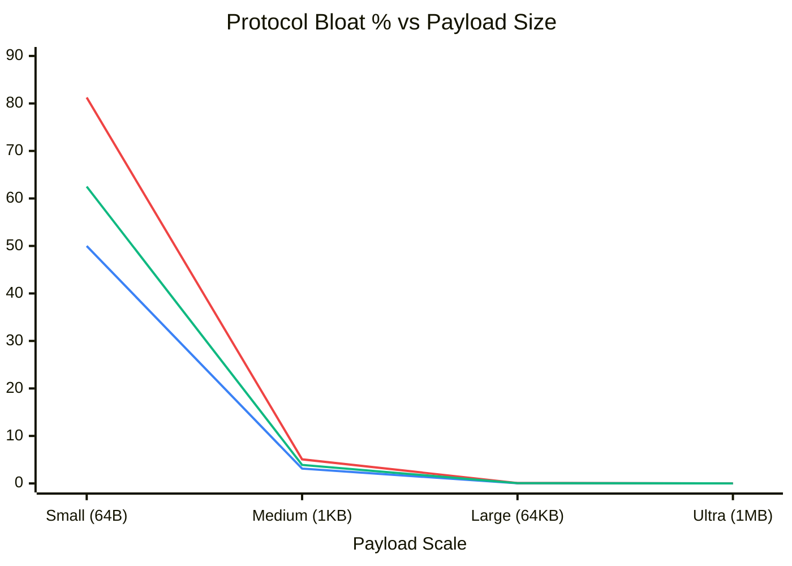

# Cryptographic Protocol Bloat Analysis

By mathematically analyzing the empirical test data retrieved from the `ProtocolBloatBenchmark`, we can observe the zero-allocation overhead introduced by the custom **Perfect 32** protocol boundaries. 

Because the protocol avoids excessive padded framing and utilizes 12-bit VarInts, the overhead is strictly constrained to the cryptographic necessities (IVs, MAC tags, and Sequences). As payload size scales up to typical video fragments, the protocol's bloat inherently asymptotically approaches zero.

### Empirical Overhead Matrix

| Profile | Security Mechanics | 64 Bytes (Ping) | 1 KB (Telemetry) | 64 KB (Video Chunk) | 1 MB (Large Frame) |
|:---|:---|:---:|:---:|:---:|:---:|
| **S=0** | Standard AES-GCM | `+50.00 %` | `+3.12 %` | `+0.048 %` | `+0.003 %` |
| **S=1** | High-Security (SIV) | `+81.25 %` | `+5.07 %` | `+0.079 %` | `+0.005 %` |
| **S=2** | Streaming API (Seq) | `+62.50 %` | `+3.90 %` | `+0.061 %` | `+0.003 %` |

---

### Visual Scaling Curve (Asymptotic Bloat Graph)

  <b>Legend: &nbsp;&nbsp;</b>
  🔵 (Blue) <b>S=0 Standard</b> &nbsp;&nbsp;|&nbsp;&nbsp;
  🔴 (Red) <b>S=1 High-Security</b> &nbsp;&nbsp;|&nbsp;&nbsp;
  🟢 (Green) <b>S=2 Streaming</b>

### Analysis
1. **IoT Edge (64B):** With tiny payloads, the required 16-byte MAC tags and 12-byte IVs dominate the frame, causing `50%+` bloat. This is physically unavoidable for mathematically sound Authenticated Encryption.
2. **Video Streaming (64KB+):** The protocol vanishes into the noise. S=2 introduces merely `~40` constant bytes per stream chunk, causing `0.06%` bloat! This validates that the `ManagedSecurity.Core` protocol is perfectly optimized for dense media payloads.
