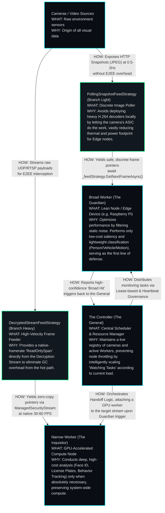

# Blueprint: Distributed Computer Vision & Orchestration

This document outlines the architectural strategy for integrating high-performance Computer Vision (CV) into the Sentinel ecosystem using a distributed "Command & Control" (C2) model.

## 🏛️ 1. Split-Phase Inference Strategy

To optimize for performance and power consumption, the CV workload is split into two distinct tiers:

### A. The "Guardian" Phase (Broad Phase)
*   **Goal**: Detect "Interesting" events with minimal overhead.
*   **Source**: HTTP Snapshots (JPEG) retrieved from cameras.
*   **Frequency**: Low (0.5 Hz - 2 Hz).
*   **Target**: Saliency detection, lightweight classification (Person, Vehicle, Motion).
*   **Cost**: extremely low. No E2EE decryption required.

### B. The "Inquisitor" Phase (Narrow Phase)
*   **Goal**: Perform deep analysis (Recognition, Tracking, OCR).
*   **Source**: High-Res Decrypted `ManagedSecurityStream`.
*   **Frequency**: High (Native Framerate, 15-60 FPS).
*   **Target**: Face ID, License Plates, Behavioral Analysis.
*   **Trigger**: Woken up only when the Guardian detects a high-confidence event.
*   **Cost**: High (CPU/GPU intensive).

## 📡 2. Orchestration Topology (General & Scouts)

The system operates in a distributed hive model to ensure massive scalability.

### The Controller (The General)
*   **Responsibility**: Central Scheduler and Resource Manager.
*   **Inventory**: Maintains a live registry of discovered cameras and active Workers.
*   **Scheduling**: Distributes "Watching Tasks" to Workers based on their current CPU/Memory load.
*   **Handoff Logic**: When a Worker reports a "Broad Hit," the General promotes the task to a Narrow-capable worker.

### The Workers (The Scouts)
*   **Responsibility**: Execution of assigned tasks.
*   **Broad Workers**: Lean nodes (Raspberry Pi, low-power VMs) running the Guardian phase.
*   **Narrow Workers**: GPU-accelerated nodes running deep inference.

## 🧠 3. Zero-Copy & Feed Strategy Abstraction

To ensure extreme scalability without forcing low-power nodes into thermal throttling, the MV ingestion acts independently of the assigned Behavioral role (Guardian vs. Inquisitor) via an `IMachineVisionFeedStrategy`.

### A. Branch Light (PollingSnapshotFeedStrategy)
*   **Mechanism**: Safely queries the camera's `SnapshotUrl` (HTTP JPEG) periodically.
*   **Target Hardware**: Edge Scouts (Raspberry Pi, lightweight VMs).
*   **Benefit**: Avoids deploying H.264 decoders locally. The ASIC on the camera does the work.

### B. Branch Heavy (DecryptedStreamFeedStrategy)
*   **Mechanism**: A continuous, zero-copy pointer feed directly from the `ManagedSecurityStream.OnFrameDecrypted` event or a local GStreamer `appsink`.
*   **Target Hardware**: Dedicated GPU Inquisitors (Remote or Local).
*   **Benefit**: Provides a native-framerate `ReadOnlySpan<byte>` without duplicating bits in memory, dropping GC overhead out of the hot path for 30+ FPS tensor evaluations.

Because of this abstraction, a Heavy node can run Guardian logic over a continuous feed if power allows, or an Inquisitor node bottlenecked by network could drop to Light mode to read snapshots. Behaviors simply request `await _feedStrategy.GetNextFrameAsync()`.

## 🚀 4. Implementation Milestone Phases

1.  **Orchestration Core**: Implement the `ManagedSecurity.Orchestration` library with the General/Worker messaging protocol.
2.  **Guardian Implementation**: Deploy the first Scout that polls HTTP snapshots and performs simple pixel-change saliency.
3.  **Narrow Handoff**: Integrate the `ManagedSecurityStream` hooks to allow a GPU worker to "Attach" to a live stream upon a Guardian trigger.

