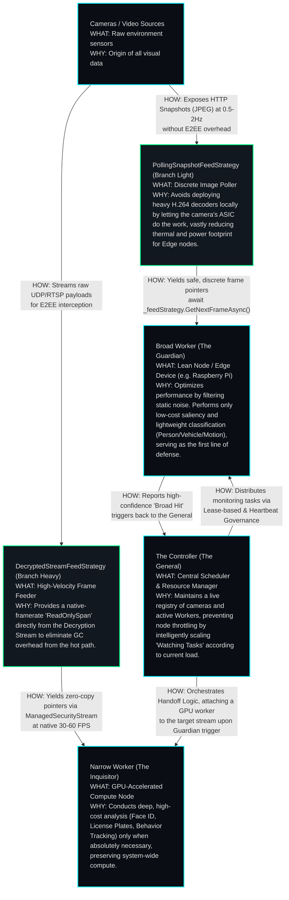

# Distributed Computer Vision & Orchestration - Visual Representation

```mermaid
graph TD
    classDef entity fill:#0a0d14,stroke:#00f2ff,stroke-width:2px,color:#e0e0e0,text-align:left,padding:10px
    classDef strategy fill:#121820,stroke:#00ff88,stroke-width:2px,color:#e0e0e0,text-align:left,padding:10px

    source["Cameras / Video Sources<br/>WHAT: Raw environment sensors<br/>WHY: Origin of all visual data"]:::entity

    general["The Controller (The General)<br/>WHAT: Central Scheduler & Resource Manager<br/>WHY: Maintains a live registry of cameras and active Workers, preventing node throttling by intelligently scaling 'Watching Tasks' according to current load."]:::entity

    feedLight["PollingSnapshotFeedStrategy (Branch Light)<br/>WHAT: Discrete Image Poller<br/>WHY: Avoids deploying heavy H.264 decoders locally by letting the camera's ASIC do the work, vastly reducing thermal and power footprint for Edge nodes."]:::strategy

    feedHeavy["DecryptedStreamFeedStrategy (Branch Heavy)<br/>WHAT: High-Velocity Frame Feeder<br/>WHY: Provides a native-framerate 'ReadOnlySpan<byte>' directly from the Decryption Stream to eliminate GC overhead from the hot path."]:::strategy

    workerBroad["Broad Worker (The Guardian)<br/>WHAT: Lean Node / Edge Device (e.g. Raspberry Pi)<br/>WHY: Optimizes performance by filtering static noise. Performs only low-cost saliency and lightweight classification (Person/Vehicle/Motion), serving as the first line of defense."]:::entity

    workerNarrow["Narrow Worker (The Inquisitor)<br/>WHAT: GPU-Accelerated Compute Node<br/>WHY: Conducts deep, high-cost analysis (Face ID, License Plates, Behavior Tracking) only when absolutely necessary, preserving system-wide compute."]:::entity


    %% Flow & Relationships ("HOW")
    source -->|"HOW: Exposes HTTP Snapshots (JPEG) at 0.5-2Hz<br/>without E2EE overhead"| feedLight
    source -->|"HOW: Streams raw UDP/RTSP payloads<br/>for E2EE interception"| feedHeavy

    feedLight -->|"HOW: Yields safe, discrete frame pointers<br/>await _feedStrategy.GetNextFrameAsync()"| workerBroad
    feedHeavy -->|"HOW: Yields zero-copy pointers via ManagedSecurityStream<br/>at native 30-60 FPS"| workerNarrow

    general -->|"HOW: Distributes monitoring tasks via<br/>Lease-based & Heartbeat Governance"| workerBroad

    workerBroad -->|"HOW: Reports high-confidence 'Broad Hit'<br/>triggers back to the General"| general

    general -->|"HOW: Orchestrates Handoff Logic, attaching a GPU worker<br/>to the target stream upon Guardian trigger"| workerNarrow
```
